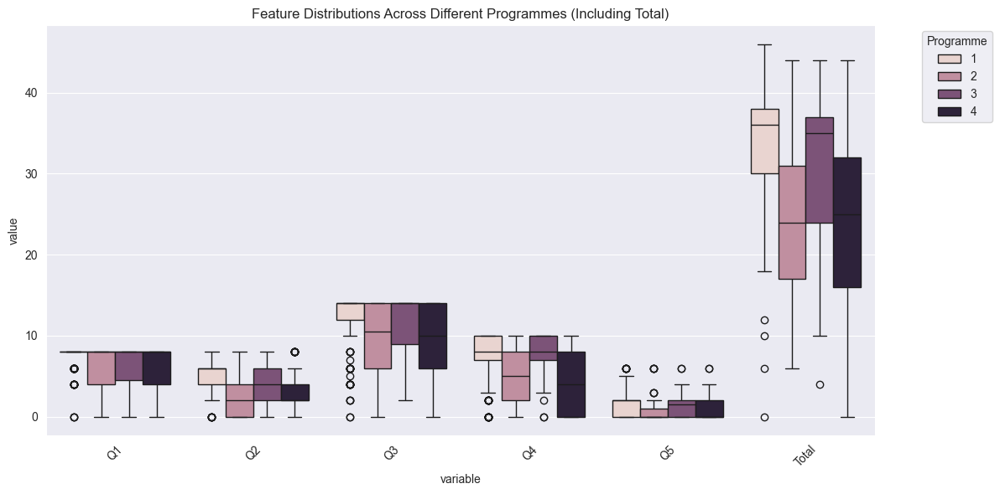
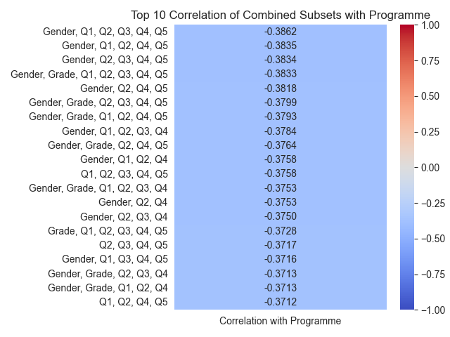
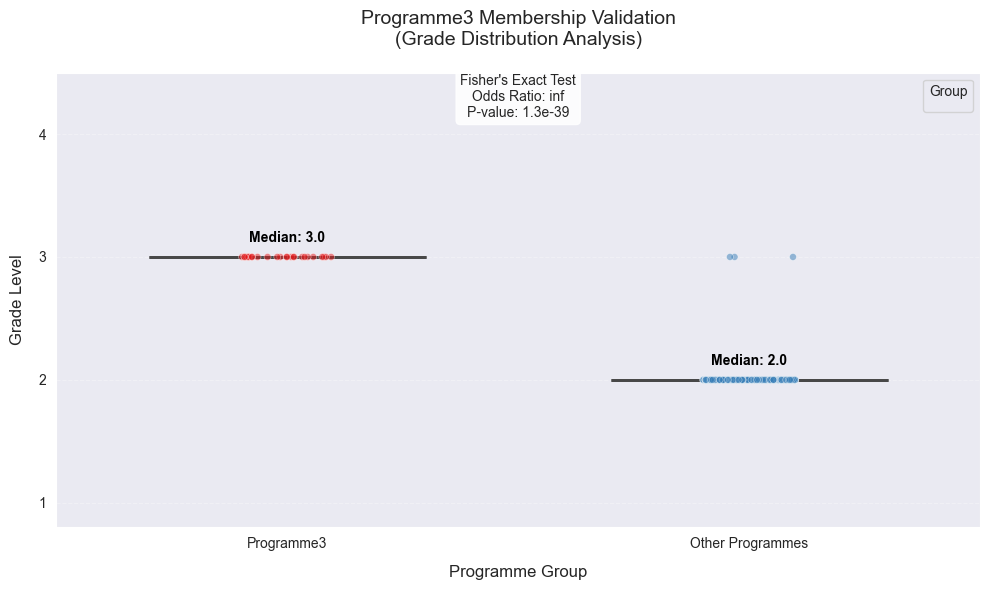

# Lab Report

**Author**: Chengfeng Zou, 2363550
**Teaching Assistant**: [TA Name]

## 1. Introduction

The analysis of student performance data to predict programme enrollment is a critical task in educational data mining. This report investigates a dataset comprising 7 features—Gender, Grade, and exam marks Q1–Q5 (with maximum scores of 8, 8, 14, 10, and 6, respectively)—and a target variable, Programme (with 4 distinct labels). The objective is to identify features and methods that effectively predict a student's Programme through data distribution analysis, feature transformation, clustering, and classification. This study aims to uncover patterns in student performance and evaluate the efficacy of various machine learning techniques.

This report addresses five tasks: observing raw data distribution (Task 1), transforming features to enhance Programme prediction (Task 2), clustering data to explore Programme associations (Task 3), building classifiers to predict Programmes (Task 4), and discussing key findings (Task 5). Experiments were conducted using Python, employing feature transformations (e.g., subset averaging, PCA, t-SNE), clustering methods (K-means, Hierarchical, Gaussian Mixture Model), and classifiers (Naive Bayes, Decision Tree, kNN, and VotingClassifier). The report is structured into Methods, Results, Discussion, and Conclusion sections, with results and discussion organized by feature selection, unsupervised learning, and supervised learning.

## 2. Methods

### 2.1 Data Preprocessing and Distribution Observation

The dataset was loaded from `training_set.csv`, containing `Gender` (1 or 2), `Grade` (2 or 3), `Q1–Q5` marks, and `Programme` (1–4). Initial preprocessing involved computing statistical measures (mean and variance) for Q1–Q5 and total scores across Programmes. Visualizations, including box plots and correlation matrix, were generated to observe score distributions and identify challenges in Programme classification, such as overlapping score ranges.

### 2.2 Feature Transformation

Three feature transformation methods were applied to enhance Programme prediction. First, all possible feature subsets were averaged to derive new features, and their correlations with Programme were computed to select the most predictive subset (`Gender`, `Q2`, `Q4`). Second, Principal Component Analysis (PCA) was applied to reduce `Q1–Q5` marks to 2 dimensions. Third, t-SNE was used to reduce all features to 2 dimensions. These transformations aimed to make samples from the same Programme more similar in distribution, facilitating clustering and classification. Features were scaled using MinMaxScaler or StandardScaler as required.

### 2.3 Clustering Experiment Design

Clustering was performed on three feature sets: Set1 (`Grade`, `Q_avg`, where `Q_avg` is the average of `Q1–Q5`, scaled with `MinMaxScaler`), Set2 (`Q1–Q5`, reduced to 2D via PCA, standardized), and Set3 (all features, reduced to 2D via t-SNE, standardized). Three clustering methods were tested: K-means (k=4, random_state=42), Hierarchical (AgglomerativeClustering, n_clusters=4, complete linkage), and Gaussian Mixture Model (GMM, n_components=4). K-means was chosen for its suitability to spherical clusters, Hierarchical for capturing hierarchical structures, and GMM for modeling mixed distributions. The inter/intra ratio (intra-cluster distance divided by inter-cluster distance) and F1-score (compared to true Programme labels) were used for evaluation.

### 2.4 Classification Experiment Design

Classification was conducted using three feature sets: Set1 (Gender, Q2, Q4, selected via correlation analysis) and Set2 (all features, standardized) Set3 (all features, non-standardized). Three classifiers were tested: Naive Bayes (`var_smoothing`=1e-9,1e-8,1e-6 to adjust feature variance sensitivity), Decision Tree (`max_depth`=3, 5, 10, None), and kNN (`n_neighbors`=3, 5, 7, 9, 11, 15 for Euclidean distance to balance bias and variance). A ensembled classifier (VotingClassifier) was built, combining Naive Bayes, Decision Tree, and kNN, with two hyperparameter configurations: Soft Voting (weighted by probabilities) and Hard Voting (majority vote). Additionally, a manual rule was tested, assigning Grade==3 to Programme 3 and retraining the classifier on other samples. Classifiers were evaluated using accuracy and F1-score on an 80/20 train-test split. The impact of StandardScaler was also assessed.

### 2.5 Evaluation Methods

Clustering performance was evaluated using the inter/intra ratio (lower values indicate tighter, more separated clusters) and F1-score (aligning cluster labels with Programme labels via permutation). Classification performance was assessed using accuracy and F1-score on the test set. Results were visualized through tables (e.g., mean/variance, performance metrics) and figures (e.g., correlation heatmaps, scatter plots). All experiments were implemented in Python using scikit-learn.

## 3. Results

### 3.1 Feature Selection Results

The distribution of Q1–Q5 and total scores across Programmes was analyzed, as shown in Table 1 and Table 2. Programme 1 and 3 exhibited higher average total scores (33.36 and 30.54, respectively) compared to Programme 2 and 4 (23.89 and 24.14). Programme 1 had the lowest variance in total score (53.63), indicating stable performance, while Programme 3 had the highest (100.82), suggesting greater variability. Figure 1 presents a box plot of total scores (Q1–Q5) across Programmes, confirming that Programme 1 has the highest median score (approximately 33) with a compact interquartile range, reflecting consistent high performance. Programme 3 follows with a median around 30 but shows greater variability with more outliers, while Programmes 2 and 4 have lower medians (around 24) and wider distributions.

**Table 1: Average Scores for Each Programme (Q1–Q5 and Total Score)**

| Programme | Q1     | Q2     | Q3      | Q4     | Q5     | Total_Score |
|-----------|--------|--------|---------|--------|--------|-------------|
| 1         | 7.2910 | 4.9524 | 12.1429 | 7.2725 | 1.6984 | 33.3571     |
| 2         | 6.0909 | 2.5909 | 9.5795  | 4.8295 | 0.7955 | 23.8864     |
| 3         | 6.3846 | 3.8462 | 11.2692 | 7.4231 | 1.6154 | 30.5385     |
| 4         | 6.2025 | 3.2025 | 9.6564  | 4.3282 | 0.7546 | 24.1442     |

**Table 2: Variances for Each Programme (Q1–Q5 and Total Score)**

| Programme | Q1     | Q2     | Q3      | Q4      | Q5     | Total_Score |
|-----------|--------|--------|---------|---------|--------|-------------|
| 1         | 2.1542 | 4.3222 | 11.2082 | 8.6767  | 2.1586 | 53.6337     |
| 2         | 6.8882 | 4.9801 | 18.2005 | 13.8672 | 2.0726 | 78.7685     |
| 3         | 6.7262 | 5.4154 | 19.8046 | 9.9338  | 3.2062 | 100.8185    |
| 4         | 5.7674 | 5.7057 | 18.7454 | 13.9055 | 1.4085 | 90.7399     |

*Figure 1: Box plot illustrating the distribution of total scores (Q1–Q5) for Programmes 1–4. Programme 1 exhibits the highest median and tightest distribution, supporting its high average score (33.36) and low variance (53.63).*

Correlation analysis identified Gender, Q2, and Q4 as the most predictive features for Programme prediction, with a correlation coefficient of -0.3753. Figure 2 illustrates the correlation heatmap of the top 20 feature subsets, highlighting the strong association of Gender, Q2, and Q4 with Programme. Additionally, a significant correlation was observed between Grade==3 and Programme==3, as depicted in Figure 3, a box plot showing the distribution of Grade and Programme labels. 
 PCA and t-SNE transformations were applied but showed limited effectiveness in enhancing Programme prediction, as discussed further in Section 4.2, likely due to the dataset's lack of distinct distributional patterns that these methods could effectively capture.

*Figure 2: Correlation heatmap displaying the top 20 feature subsets, with Gender, Q2, and Q4 exhibiting high correlation (-0.3753) with Programme.*

*Figure 3: Box plot illustrating the strong correlation between Grade==3 and Programme==3, indicating a structural relationship in the dataset.*

### 3.2 Unsupervised Learning Results

Clustering was performed using Hierarchical Clustering on three different feature sets, and the results are summarized in Table 3a. Set1 (Grade, Q_avg, MinMaxScaler) achieved the lowest inter/intra ratio (0.1519), indicating tight and well-separated clusters, but its F1-score (0.4213) was lower than that of Set3, which utilized all features (inter/intra ratio = 0.6897, F1-score = 0.5739). Reducing the number of features generally led to a decrease in the inter/intra ratio but a deterioration in alignment with the true Programme labels. The most extreme case, using only Grade and Gender without scaling, yielded an inter/intra ratio of 0.0, yet still produced a relatively poor F1-score (0.4520).

**Table 3a: Clustering Performance Across Feature Sets**

| Feature Set                  | Inter/Intra Ratio | F1-Score  |
|------------------------------|-------------------|-----------|
| All features                 | 0.6897            | 0.5739    |
| (Gender, Grade, Q_avg)       | 0.2087            | 0.4520    |
| (Grade, Q_avg)               | 0.1519            | 0.4213    |
| (Grade, Gender, no scaling)  | 0.0               | 0.4520    |

To further evaluate the impact of dimensionality reduction, Hierarchical Clustering was applied to feature sets transformed with PCA and t-SNE. Table 3b compares the inter/intra ratios for Hierarchical Clustering on Set1 (Gender, Grade, Q_avg), Set2 (Q1–Q5 reduced to 2D via PCA), and Set3 (all features reduced to 2D via t-SNE). Set2 and Set3 exhibited higher inter/intra ratios (0.3424 and 0.2521, respectively) compared to Set1 (0.2087), indicating less compact and less separated clusters, which suggests that PCA and t-SNE did not effectively capture the dataset’s structure for clustering.

**Table 3b: Hierarchical Clustering Performance with Dimensionality Reduction**

| Feature Set                     | Inter/Intra Ratio |
|---------------------------------|-------------------|
| Set1 (Gender, Grade, Q_avg)     | 0.2087            |
| Set2 (Q1–Q5 PCA)                | 0.3424            |
| Set3 (All Features t-SNE)       | 0.2521            |

Table 4 compares clustering methods on the (Gender, Grade, Q_avg) feature set. Hierarchical clustering achieved the lowest inter/intra ratio (0.2087) but the lowest F1-score (0.4520), indicating overfitting. K-means had a higher ratio (0.2652) but the highest F1-score (0.5475), suggesting better alignment with Programme labels.

**Table 4: Clustering Method Comparison (Gender, Grade, Q_avg)**

| Method             | Intra/Inter Ratio | F1-Score  |
|--------------------|-------------------|-----------|
| K-means            | 0.2652          | 0.5475  |
| Hierarchical       | 0.2087          | 0.4520  |
| Gaussian Mixture   | 0.2647          | 0.4339  |

### 3.3 Supervised Learning Results

Classification performance is summarized in Table 5, with optimal hyperparameters reported for each classifier. Naive Bayes performed best on Set1 (Gender, Q2, Q4, accuracy=0.5536, var_smoothing=1e-9) compared to Set2 (0.5449), while Decision Tree (max_depth=3, accuracy=0.5601) and kNN (n_neighbors=15, accuracy=0.5729) performed better on Set2 than Set1.
Table 9 shows Naive Bayes’ var_smoothing results, with no significant variation (0.5536). Table 10 details Decision Tree’s max_depth results, with max_depth=3 outperforming deeper trees (0.5601 vs. 0.5387 for max_depth=None). Table 11 presents kNN’s n_neighbors results, with n_neighbors=15 achieving the highest accuracy (0.5729), likely due to its ability to capture Programme 1’s high-score distribution (Figure 3). 

**Table 5: Classifier Performance Across Feature Sets (Optimal Hyperparameters)**

| Classifier    | Feature Set (Good) | Accuracy | Feature Set (Bad) | Accuracy |
|---------------|-------------------|----------|-------------------|----------|
| Naive Bayes   | Set 1             | 0.5536   | Set 2             | 0.5449 |
| Decision Tree | Set 2             | 0.5601   | Set 1             | 0.5172   |
| KNN           | Set 2             | 0.5729   | Set 1             | 0.5215   |

**Table 9: Naive Bayes Performance with var_smoothing (Set1)**

| var_smoothing | Mean Accuracy | Std Dev  |
|---------------|---------------|----------|
| 1e-9          | 0.5536        | 0.0744   |
| 1e-8          | 0.5536        | 0.0744   |
| 1e-6          | 0.5536        | 0.0744   |

**Table 10: Decision Tree Performance with max_depth (Set2, min_samples_leaf=5)**

| max_depth | Mean Accuracy | Std Dev  |
|-----------|---------------|----------|
| 3         | 0.5601        | 0.0728   |
| 5         | 0.5471        | 0.1001   |
| 10        | 0.5387        | 0.0633   |
| None      | 0.5387        | 0.0633   |

**Table 11: kNN Performance with n_neighbors (Set2, p=2)**

| n_neighbors | Mean Accuracy | Std Dev  |
|-------------|---------------|----------|
| 3           | 0.5321        | 0.1180   |
| 5           | 0.5515        | 0.0960   |
| 7           | 0.5450        | 0.0853   |
| 9           | 0.5535        | 0.0645   |
| 11          | 0.5600        | 0.0656   |
| 15          | 0.5729        | 0.0664   |

A VotingClassifier combining Naive Bayes, Decision Tree, and kNN was tested on all features (standardized), with Soft Voting (accuracy=0.5620) and Hard Voting (0.5428), as shown in Table 8. The ensemble underperformed compared to kNN alone (0.5729), likely due to Naive Bayes’ sensitivity to high feature counts and Decision Tree’s inferior performance.

**Table 8: Ensemble Classifier Performance**

| Classifier       | Feature Set       | Accuracy  |
|------------------|-------------------|-----------|
| Voting (Soft)    | All Features      | 0.5620    |
| Voting (Hard)    | All Features      | 0.5428    |
| kNN              | All Features      | 0.5729    |

StandardScaler improved kNN’s accuracy (0.5729 vs. 0.4956 without scaling), but had no effect on Naive Bayes or Decision Tree (Table 6). kNN analysis revealed that students predicted as Programme 1 had a higher average total score (37.09) compared to others (26.01), as shown in Table 7. This trend aligns with the high total score distribution of Programme 1 observed in Figure 3 and Table 1, confirming that classifiers leverage the dataset’s inherent score patterns. A manual rule assigning Grade==3 to Programme 3 did not improve kNN’s accuracy (0.5606 vs. 0.5729, Table 12), suggesting the model already learned this pattern.

**Table 6: Scaler Impact on Classifier Performance**

| Classifier    | Without Scaler | With Standard Scaler |
|---------------|----------------|----------------------|
| Naive Bayes   | 0.5536         | 0.5536               |
| Decision Tree | 0.5601         | 0.5601               |
| KNN           | 0.4956         | 0.5729               |

**Table 7: Average Total Scores for kNN Predictions**

| Group                     | Average Total Score |
|---------------------------|---------------------|
| Predicted Programme 1      | 37.090909           |
| Predicted Not Programme 1  | 26.012821           |

**Table 12. Comparison of kNN accuracy with and without manual rule assignment**

| Method                               | Accuracy |
|--------------------------------------|----------|
| Manual Rule Assignment + kNN         | 0.5606   |
| Standard kNN                         | 0.5729   |

## 4. Discussion

### 4.1 Feature Selection

The distinct score distributions across Programmes provide insights into their characteristics. Programmes 1 and 3, with higher average total scores (33.36 and 30.54, Figure 1 and Table 1), likely represent academically stronger cohorts, while Programmes 2 and 4 (23.89 and 24.14) indicate lower performance. Programme 1’s low variance (53.63, Table 2) suggests consistent performance, whereas Programme 3’s high variance (100.82) reflects diverse abilities. The high correlation of Gender, Q2, and Q4 with Programme (-0.3753, Figure 2) suggests these features capture Programme-specific patterns, possibly related to gender distribution or exam difficulty. The strong correlation between Grade==3 and Programme==3 (Figure 3) indicates a structural relationship, possibly due to curriculum design. PCA and t-SNE’s poor performance suggests the dataset lacks clear manifold structures, limiting dimensionality reduction benefits.

### 4.2 Unsupervised Learning

The clustering results highlight a clear trade-off between cluster compactness and alignment with true Programme labels. Feature sets with fewer dimensions, such as Set1 (Grade, Q_avg, inter/intra ratio = 0.1519), produced lower inter/intra ratios, indicating more compact and well-separated clusters. However, their corresponding lower F1-scores (0.4213, Table 3a) suggest poor alignment with the true labels, likely because essential information was lost during feature reduction. This observation indicates that blindly minimizing the inter/intra ratio does not necessarily lead to better clustering outcomes in terms of true label alignment.

Moreover, feature sets obtained through dimensionality reduction techniques, such as Set2 (PCA) and Set3 (t-SNE), also underperformed in terms of cluster compactness when used with Hierarchical Clustering. Specifically, Set2 exhibited the highest inter/intra ratio (0.3424), followed by Set3 (0.2521), both of which are notably higher than Set1 (0.2087, Table 3b). This suggests that the dimensionality reduction failed to capture meaningful structure in the data, leading to more dispersed and less coherent clusters. A likely explanation for this poor performance is the dataset's lack of strong distributional patterns, which both PCA and t-SNE depend on to project high-dimensional data into informative lower-dimensional representations. In this case, the application of dimensionality reduction did not enhance clustering performance and, in fact, introduced more noise and ambiguity into the clustering process.

Furthermore, comparisons across clustering algorithms show that Hierarchical Clustering, despite achieving the lowest inter/intra ratio (0.2087, Table 4), resulted in the lowest F1-score (0.4520), suggesting potential overfitting to noise or to structures that do not correspond well to Programme boundaries. In contrast, K-means clustering achieved a higher inter/intra ratio (0.2652) but delivered a significantly better F1-score (0.5475), indicating that assuming spherical cluster shapes provided a more robust match to the underlying data distribution.

### 4.3 Supervised Learning

Classification results reveal model-specific feature preferences and hyperparameter impacts. Naive Bayes performed better with fewer features (Set1, 0.5536, Table 5), likely due to its assumption of feature independence, which is violated with many features (Set2, 0.5449). Varying var_smoothing (1e-9 to 1e-6, Table 9) had no impact, suggesting the dataset’s distribution is relatively simple or feature variances are balanced. Conversely, Decision Tree and kNN benefited from all features (Set2, 0.5601 and 0.5729), as they can model complex interactions. For Decision Tree, max_depth=3 achieved the highest accuracy (0.5601, Table 10), indicating that a shallow tree prevents overfitting, while deeper trees (max_depth=10 or None, 0.5387) overfit, capturing noise. For kNN, n_neighbors=15 yielded the highest accuracy (0.5729, Table 11) compared to smaller values (e.g., n_neighbors=3, 0.5321), likely due to its ability to balance bias and variance, effectively capturing Programme 1’s high-score distribution (median approximately 33, Figure 3; mean 33.36, Table 1). The VotingClassifier’s inferior performance (Soft: 0.5620, Hard: 0.5428, Table 8) compared to kNN (0.5729) can be attributed to Naive Bayes’ sensitivity to high feature counts and Decision Tree’s suboptimal accuracy, diluting the ensemble’s effectiveness. StandardScaler’s necessity for kNN (0.5729 vs. 0.4956, Table 6) reflects its reliance on distance metrics, unlike Naive Bayes and Decision Tree, which are scale-invariant. The tendency of kNN to assign high-scoring students (average total score 37.09, Table 7) to Programme 1 aligns with the high total score distribution of Programme 1 (median approximately 33, Figure 1; mean 33.36, Table 1), indicating that kNN effectively captures the dataset’s inherent score patterns. The manual rule assigning Grade==3 to Programme 3 did not improve performance (0.5606 vs. 0.5729, Table 12), suggesting that classifiers already capture this pattern. 

## 5. Conclusion

This study identified key patterns in student performance data for Programme prediction. Programme 1 and 3 exhibited superior performance with distinct variance profiles, while Gender, Q2, and Q4 emerged as highly predictive features. Clustering revealed that fewer features improve inter/intra ratios but reduce alignment with true labels, with Hierarchical clustering prone to overfitting and K-means offering better robustness. Classification results confirmed kNN’s effectiveness with all features, particularly its bias toward assigning high-scoring students to Programme 1. The ensemble classifier, while comprehensive, underperformed due to weaker base models.

Future work could explore additional feature combinations (e.g., Q1+Q3) to enhance predictive power, test alternative clustering methods like DBSCAN to handle non-spherical distributions, and validate the Programme 1 high-score trend on larger datasets, which could deploying kNN-based models in educational settings to tailor advanced coursework or enrichment programs for students likely to excel, thereby optimizing resource allocation. These efforts could further refine the understanding of Programme-specific patterns and improve prediction accuracy.
